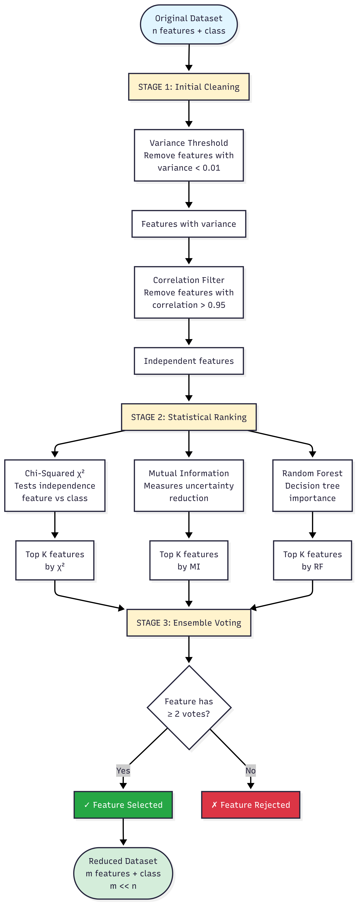

# Feature Selection for Malware Detection

Automated feature selection pipeline for high-dimensional binary malware datasets using statistical methods and ensemble voting.

## 📋 Overview

This tool reduces the dimensionality of malware permission datasets by selecting the most discriminative features using multiple statistical methods:

- **Variance Thresholding**: Removes low-variance features
- **Correlation Filtering**: Eliminates redundant features
- **Chi-Squared Test**: Measures feature-class independence
- **Mutual Information**: Captures non-linear relationships
- **Random Forest Importance**: Evaluates predictive power
- **Ensemble Voting**: Selects features agreed upon by multiple methods

## 🎯 Problem Statement

Malware datasets often contain hundreds of binary features (permissions), where:
- Each column represents a permission (1 = granted, 0 = denied)
- The `class` column indicates malware (1) or benign (0)
- Many features are redundant or uninformative

This tool automatically reduces feature count while maintaining discriminative power.

## 🚀 Quick Start

### Installation
```bash
pip install scikit-learn pandas numpy matplotlib seaborn
```

### Basic Usage
```python
import pandas as pd
from feature_selector import MalwareFeatureSelector

# Load your dataset
df = pd.read_csv('malware_dataset.csv')

# Create selector
selector = MalwareFeatureSelector(df, target_col='class')

# Auto-select features
selected_features = selector.auto_select(target_features=50)

# Get reduced dataset
reduced_df = selector.get_reduced_dataset()
reduced_df.to_csv('reduced_dataset.csv', index=False)

# Save all results
selector.save_results()
```

## 📊 Pipeline Workflow
```
Original Dataset (n features)
         ↓
┌─────────────────────────────┐
│  STAGE 1: Preprocessing     │
├─────────────────────────────┤
│ • Remove low variance       │
│ • Remove high correlation   │
└─────────────────────────────┘
         ↓
┌─────────────────────────────┐
│  STAGE 2: Statistical       │
│           Ranking           │
├─────────────────────────────┤
│ • Chi-Squared (χ²)         │
│ • Mutual Information        │
│ • Random Forest Importance  │
└─────────────────────────────┘
         ↓
┌─────────────────────────────┐
│  STAGE 3: Ensemble Voting   │
├─────────────────────────────┤
│ • Select features with      │
│   min_votes ≥ 2             │
└─────────────────────────────┘
         ↓
Reduced Dataset (m features)
   where m << n
```

## 🔧 Configuration

### Constructor Parameters
```python
MalwareFeatureSelector(
    df,                        # Your DataFrame
    target_col='class',        # Target column name
    variance_threshold=0.01    # Minimum variance to keep feature
)
```

### Auto-Selection Parameters
```python
selector.auto_select(
    target_features=50,           # Target number of features (None=automatic)
    correlation_threshold=0.95    # Max correlation between features
)
```

### Ensemble Parameters
```python
selector.ensemble_selection(
    methods=['chi2', 'mutual_info', 'rf'],  # Methods to use
    min_votes=2,                             # Minimum votes required
    top_k=50                                 # Top features per method
)
```

## 📈 Output Files

Running `selector.save_results()` creates:
```
feature_selection_results/
├── selected_features.csv          # List of selected features
├── chi2_scores.csv                # Chi-squared scores
├── mutual_info_scores.csv         # Mutual information scores
├── rf_importance_scores.csv       # Random Forest importance
├── ensemble_votes_scores.csv      # Voting results
├── reduced_dataset.csv            # Dataset with selected features
└── summary.txt                    # Selection summary
```

## 📊 Visualization
```python
# Plot feature importance scores
selector.plot_feature_scores(
    top_n=30,                      # Number of features to show
    save_path='importance.png'     # Save location
)
```

Generates 4 subplots:
- Chi-Squared scores
- Mutual Information scores
- Random Forest importance
- Ensemble voting results

## 💡 Examples

### Example 1: Automatic Selection
```python
# Let the algorithm decide optimal feature count
selector = MalwareFeatureSelector(df)
features = selector.auto_select()  # ~10% of original features
```

### Example 2: Fixed Target
```python
# Select exactly 30 features
selector = MalwareFeatureSelector(df)
features = selector.auto_select(target_features=30)
```

### Example 3: Strict Correlation
```python
# Remove highly correlated features (>0.85)
selector = MalwareFeatureSelector(df)
features = selector.auto_select(correlation_threshold=0.85)
```

### Example 4: Custom Methods
```python
# Use only Chi-Squared and Mutual Information
selector = MalwareFeatureSelector(df)
selector.remove_low_variance()
selector.correlation_filter()

features = selector.ensemble_selection(
    methods=['chi2', 'mutual_info'],
    min_votes=2,
    top_k=40
)
```

## 🎓 Statistical Methods Explained

### 1. Variance Threshold
Removes features with near-constant values (e.g., permission granted in 99% of samples).

### 2. Correlation Filter
Eliminates redundant features (e.g., INTERNET and NETWORK_STATE often co-occur).

### 3. Chi-Squared (χ²)
Tests independence between feature and class. High scores indicate strong association with malware/benign classification.

### 4. Mutual Information
Measures how much knowing a feature reduces uncertainty about the class. Captures non-linear relationships.

### 5. Random Forest Importance
Evaluates feature importance through decision tree splits. Represents real predictive power.

### 6. Ensemble Voting
Selects features that appear in multiple methods' top rankings, ensuring robustness.

### Diagram:


## 📋 Expected Results

Typical reduction rates:

| Original Features | Selected Features | Reduction |
|------------------|-------------------|-----------|
| 200              | 40-60             | 70-80%    |
| 500              | 50-100            | 80-90%    |
| 1000             | 80-150            | 85-92%    |

## ⚙️ Requirements
```txt
scikit-learn>=1.0.0
pandas>=1.3.0
numpy>=1.21.0
matplotlib>=3.4.0
seaborn>=0.11.0
```

## 🐛 Troubleshooting

### Issue: Too many features selected
**Solution**: Decrease `target_features` or increase `min_votes` to 3

### Issue: Too few features selected
**Solution**: Increase `target_features` or decrease `correlation_threshold`

### Issue: Low variance removes too many features
**Solution**: Decrease `variance_threshold` (try 0.001)

## 📝 Dataset Format

Expected CSV format:
```
permission_1,permission_2,permission_3,...,class
1,0,1,...,1
0,1,0,...,0
1,1,1,...,1
```

Requirements:
- Binary features (0 or 1)
- Target column named `class` (or specify custom name)
- No missing values

## 🔬 Advanced Usage

### Access Individual Scores
```python
# Get Chi-Squared scores
chi2_scores = selector.feature_scores['chi2']
print(chi2_scores.head(10))

# Get Mutual Information scores
mi_scores = selector.feature_scores['mutual_info']

# Get ensemble votes
votes = selector.feature_scores['ensemble_votes']
```

### Custom Pipeline
```python
# Build your own pipeline
selector = MalwareFeatureSelector(df)

# Step 1: Clean
features = selector.remove_low_variance()
selector.X = selector.X[features]

# Step 2: Custom selection
chi2_features = selector.chi_squared_selection(k=30)
mi_features = selector.mutual_information_selection(k=30)

# Step 3: Intersection
final_features = list(set(chi2_features) & set(mi_features))
```

## 📚 References

- Scikit-learn Feature Selection: https://scikit-learn.org/stable/modules/feature_selection.html
- Chi-Squared Test: https://en.wikipedia.org/wiki/Chi-squared_test
- Mutual Information: https://en.wikipedia.org/wiki/Mutual_information

---

**Note**: This tool is optimized for binary classification problems with binary features. For multi-class or continuous features, modifications may be needed.